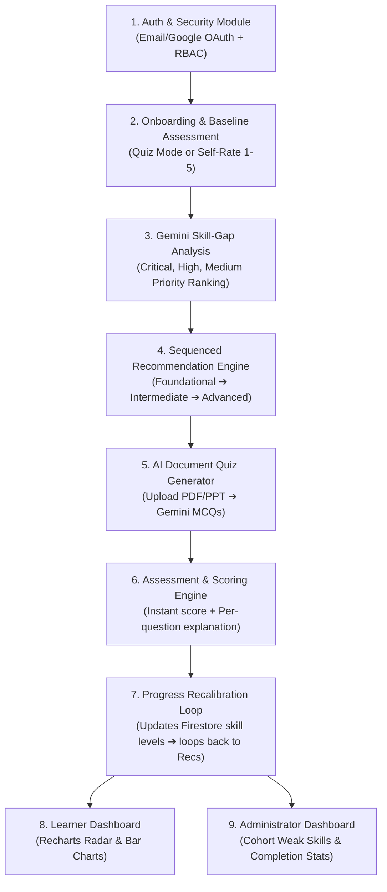

# 🌉 Skill Setu — AI-Enabled Skill Assessment & Course Recommendation Platform

> **Bridging the gap between abundant course content and structured, role-ready career outcomes.**

[](https://vercel.com/new)
[](https://github.com/Itsmeaadeesh/mp)
[](https://github.com/Itsmeaadeesh/mp)

---

## 🎯 The Problem it Solves

Learners today have access to thousands of tutorials, video series, and documentation sites, but lack a structured, personalized method to know:
1. What baseline skills they already possess versus what the industry role actually demands.
2. What their critical skill gaps are, ranked by urgency.
3. How to sequence their learning curve so foundational principles are cemented before advanced frameworks.
4. How to evaluate their conceptual mastery from their own study documents and lecture materials.

**Skill Setu** provides an end-to-end, closed-loop solution:
`Baseline Diagnostic Assessment` ➔ `Gemini AI Gap Analysis` ➔ `Sequenced Learning Paths` ➔ `Document-to-Quiz Evaluation` ➔ `Continuous Skill Recalibration` ➔ `Cohort Analytics`.

---

## 🏗️ Tech Stack

| Layer | Technologies |
|---|---|
| **Frontend** | React 18, TypeScript, Vite, TailwindCSS, Recharts, Lucide Icons, Canvas-Confetti |
| **Backend** | Node.js, Express, TypeScript, Multer, `pdf-parse` (deployable as Firebase Cloud Functions or standalone on Render/Railway) |
| **Database** | Cloud Firestore (NoSQL, 9 collections, realtime queries, indexes) |
| **Auth & Security** | Firebase Authentication (Email/Password, Google OAuth), Custom Claims (`learner` vs `admin`), granular Firestore & Storage Security Rules |
| **Storage** | Firebase Storage (scoped to `uploads/{uid}/*` for uploaded syllabus/PDFs/PPTs) |
| **Generative AI** | Google Gemini API (`gemini-1.5-flash` for multi-stage gap reasoning & MCQ question synthesis) |
| **Deployment** | Frontend on **Vercel**, Backend deployable on **Firebase Cloud Functions** or **Render** |

---

## 🔄 The 9 Platform Modules



### 1. Authentication & Security Module
- User sign-up and login via Email/Password or Google OAuth.
- Role-based access control (`learner` vs `admin`) enforced through Firebase custom claims and verified in Firestore security rules.
- First-login onboarding triggers track selection.

### 2. Skill Assessment Module
- Learners select a target track (e.g., *Frontend Developer*, *Data Analyst*, *Cloud & DevOps*, *AI/ML Engineer*, *Full-Stack Developer*).
- Learners establish baseline proficiency through either:
  - **(a) Diagnostic Quiz**: Interactive scenario-based technical questions.
  - **(b) Self-Assessment Sliders**: Granular rating (Level 1–5: Novice to Expert) per skill.
- Results are recorded in the `assessments/{id}` collection and applied to the learner profile.

### 3. Skill-Gap Analysis Module
- Compares the learner's current capabilities against required benchmarks for the chosen track.
- Calculates gap scores weighted by skill importance.
- Assigns priority tiers:
  - 🔴 **Critical Bottleneck**: Deficit stalls downstream progress.
  - 🟡 **High Priority**: Essential for everyday role responsibilities.
  - 🔵 **Medium Priority**: Enhances proficiency and autonomy.
  - 🟢 **On Target**: Meets or exceeds target benchmark.
- Google Gemini synthesizes an executive learning advisory with targeted advice.

### 4. Course Catalogue & Recommendation Module
- Queries the course catalogue for content tagged to missing skills.
- Sequenced strictly using hierarchical prerequisites: **Foundational skills appear before intermediate and advanced topics**.
- Real-time status tags: `current`, `locked`, `completed`.

### 5. AI Quiz Generation Module
- Upload PDF, PPT, or text notes to Firebase Storage.
- Backend extracts text using `pdf-parse` and passes it to Google Gemini API.
- Generates 5–10 conceptual multiple-choice questions with 4 options, the correct answer index, and detailed educational explanations.

### 6. Assessment & Scoring Module
- Learners attempt quizzes with an interactive, timed interface.
- Evaluates answers instantly with immediate feedback.
- Displays the correct answer and a full explanation for **every question** (both right and wrong).

### 7. Progress Update Module
- Completing courses or scoring ≥60% on quizzes automatically levels up skills in `users/{uid}`.
- Re-triggers the recommendation engine to unlock subsequent modules in the learning path.

### 8. Learner Dashboard Module
- Visualized with **Recharts**:
  - **Skill Competency Radar**: Current proficiency vs target benchmark.
  - **Priority Gap Bar Chart**: Level deficit magnitude per skill.
  - Next unlocked course card with instant resume action.
  - History of all quiz attempts and scores over time.

### 9. Administrator Dashboard Module
- Batch-level aggregate telemetry across registered learners:
  - **Most Common Weak Skills**: Frequency of deficits across the entire cohort.
  - **Average Track Readiness**: Mean benchmark alignment per specialization.
  - **Course Completion Rates** & average quiz pass rates.
  - **Course Catalogue CRUD**: Add, edit, or delete courses.

---

## 🗄️ Cloud Firestore Collections Schema

| Collection | Document ID | Key Fields | Purpose |
|---|---|---|---|
| `users` | `{uid}` | `email`, `displayName`, `role` (`learner`/`admin`), `targetTrackId`, `skillLevels` | Learner profile and competency levels |
| `skillCategories` | `{id}` | `trackName`, `description`, `icon`, `skills: [{ id, name, category, targetLevel, weight }]` | Target tracks and benchmark skill definitions |
| `assessments` | `{id}` | `userId`, `trackId`, `mode` (`quiz`/`self_rate`), `results`, `score`, `completedAt` | Diagnostic baseline attempts |
| `skillGapReports` | `{id}` | `userId`, `trackId`, `gaps: [{ skillId, currentLevel, requiredLevel, priority, rationale }]`, `overallMatchScore`, `aiSummary` | Priority-ranked skill gap reports |
| `courses` | `{id}` | `title`, `provider`, `duration`, `rating`, `level` (`foundational`/`intermediate`/`advanced`), `skillTags` | Internal course catalogue repository |
| `recommendations` | `{id}` | `userId`, `trackId`, `path: [{ courseId, order, completed, status }]`, `completionPercentage` | Ordered, sequenced learning paths |
| `quizQuestions` | `{id}` | `quizId`, `question`, `options`, `correctAnswerIndex`, `explanation`, `skillTag` | AI-generated MCQs with explanations |
| `quizAttempts` | `{id}` | `userId`, `quizId`, `score`, `percentage`, `answers: [{ questionId, selectedOption, isCorrect, explanation }]` | Historical quiz attempt records |
| `progressLogs` | `{id}` | `userId`, `timestamp`, `skillLevels`, `overallMastery`, `trigger` | Chronological mastery tracking over time |

---

## 📡 API & Cloud Function Endpoints

```
POST /api/auth/set-role              - Assign custom claims and profile role (Learner/Admin)
POST /api/auth/sync-profile          - Synchronize user profile on login
GET  /api/tracks                     - Retrieve all available skill tracks
POST /api/onboarding/select-track    - Save learner's chosen track
GET  /api/assessment/start           - Retrieve diagnostic quiz or self-rate criteria
POST /api/assessment/submit          - Submit assessment, trigger gap analysis & path
GET  /api/assessment/results         - Get latest assessment outcomes
POST /api/skillgap/analyze           - Gemini AI skill gap analysis and priority ranking
GET  /api/skillgap/latest            - Retrieve latest gap report for user
POST /api/recommendations/generate   - Build or recalculate ordered learning path
GET  /api/recommendations/latest     - Fetch current learning path
POST /api/recommendations/complete-course - Mark course complete and advance next module
POST /api/quiz/generate              - Upload doc ➔ Gemini ➔ MCQs with explanations
GET  /api/quiz/:id                   - Fetch quiz questions (sanitized for attempt)
POST /api/quiz/:id/submit            - Score quiz + per-question explanations + skill level up
GET  /api/quiz/attempts/:userId      - Fetch learner quiz history
POST /api/progress/update            - Update skills, recalculate path, log history
GET  /api/progress/history           - Historical progression logs
GET  /api/courses                    - List course catalogue with filter parameters
POST /api/courses                    - Add new course (Administrator)
PUT  /api/courses/:id                - Update course details (Administrator)
DELETE /api/courses/:id             - Remove course (Administrator)
GET  /api/dashboard/learner          - Skills, gaps, path, progress, and Recharts data
GET  /api/dashboard/admin            - Aggregate cohort trends, weak skills, completion rates
```

---

## 🔒 Security Rules

### Firestore Security (`firestore.rules`)
```javascript
// Learners can only access their own records; Administrators get full access
match /users/{userId} {
  allow read, write: if request.auth != null && (request.auth.uid == userId || request.auth.token.role == 'admin');
}
match /assessments/{id} {
  allow read, write: if request.auth != null && (resource.data.userId == request.auth.uid || request.auth.token.role == 'admin');
}
```

### Firebase Storage Security (`storage.rules`)
```javascript
// Uploads restricted to authenticated users and scoped to uploads/{userId}/*
match /uploads/{userId}/{allPaths=**} {
  allow read, write: if request.auth != null && request.auth.uid == userId;
}
```

---

## 🚀 Setup & Local Execution

### 1. Clone the repository
```bash
git clone https://github.com/Itsmeaadeesh/mp.git
cd mp
```

### 2. Configure Environment Variables
Copy `.env.example` to root `.env` or set in `server/` and `client/`:
```bash
cp .env.example .env
```

### 3. Install Dependencies
```bash
npm run install:all
```

### 4. Run Locally
```bash
npm run dev
```
- **Frontend**: `http://localhost:5173`
- **Backend API**: `http://localhost:5000/api`

---

## 🌐 Deployment

### Frontend (Vercel)
The project includes a ready-to-deploy `vercel.json` configured for Vite SPA routing:
```bash
npx vercel --prod
```

### Backend (Firebase Cloud Functions / Render)
Deploy directly to Firebase Functions:
```bash
firebase deploy --only functions,firestore,storage
```
Or deploy `server/` as a containerized web service on Render/Railway.

---

## 📄 License
MIT License © 2026 Skill Setu Team